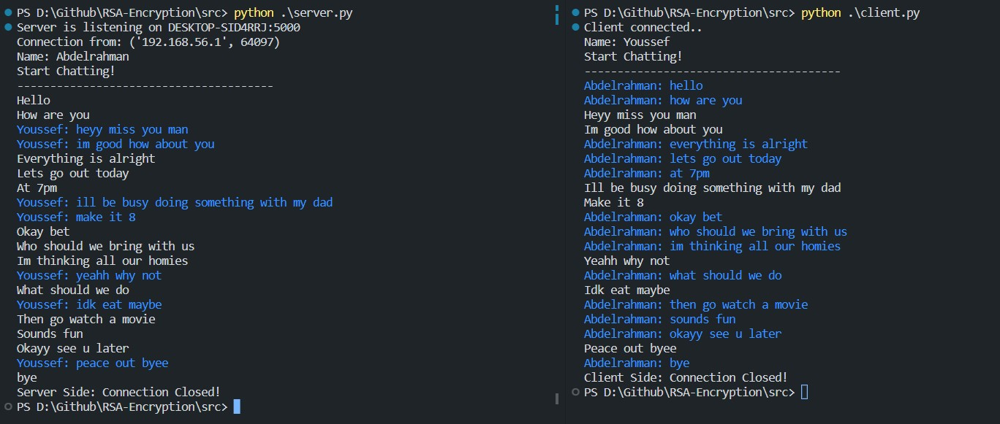

# RSA-Encryption

## 📝 Table of Contents

- [About](#about)
- [Technology](#tech)
- [Screenshots](#Screenshots)
- [Contributors](#Contributors)
- [License](#license)

## 📙 About <a name = "about"></a>

- A program that encrypts/decrypts text using the RSA algorithm along with another one that tries to break it & gets the correct private key (Different Key Sizes). The RSA Algorithm is based on the mathematical properties of prime numbers and modular arithmetic, and its security relies on the difficulty of factoring large composite numbers into their prime factors. We will attempt such an attack in this project and we’ll also analyze different key sizes with their computation time.

## 💻 Built Using <a name = "tech"></a>

- **Python**
- **Socket-IO**
- **Threading**
- **Matplotlib**

<hr>
<br>

<li>Clone the repository.

<br>

```
git clone https://github.com/AbdelrahmanHamdyy/RSA-Encryption
```

<li>Install packages.

<br>

```
pip install sympy --user
```

```
pip install matplotlib
```

```
pip install sockets
```

<li>Navigate to src directory.

<br>

```
cd src
```

<li>Run Server.

<br>

```
python server.py
```

<li>Open a new terminal and Run client.

<br>

```
python client.py
```

<br>

<li>To run the attack:

<br>

```
python attackRSA.py
```

<li>Enter number of bits & plain text

<li>Will print success if the key was obtained correctly, else failed

<br>

<hr>

## 📷 Screenshots <a name = "Screenshots"></a>

<div align="center">
   </a>
   <hr>
</div>

## Contributors <a name = "Contributors"></a>

<table>
  <tr>
    <td align="center">
    <a href="https://github.com/AbdelrahmanHamdyy" target="_blank">
    
    <br />
    <sub><b>Abdelrahman Hamdy</b></sub></a>
    </td>
  </tr>
 </table>

## License <a name = "license"></a>

> This software is licensed under MIT License, See [License](https://github.com/AbdelrahmanHamdyy/RSA-Encryption/blob/main/LICENSE) for more information ©AbdelrahmanHamdyy.
